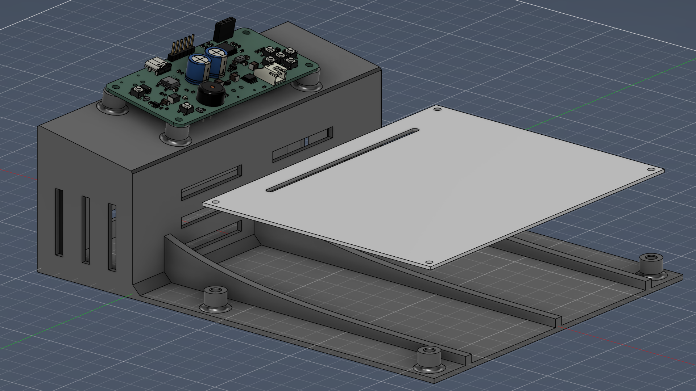
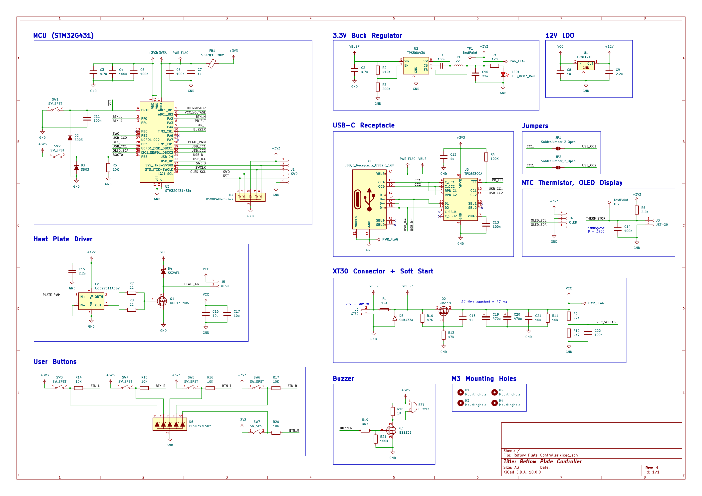
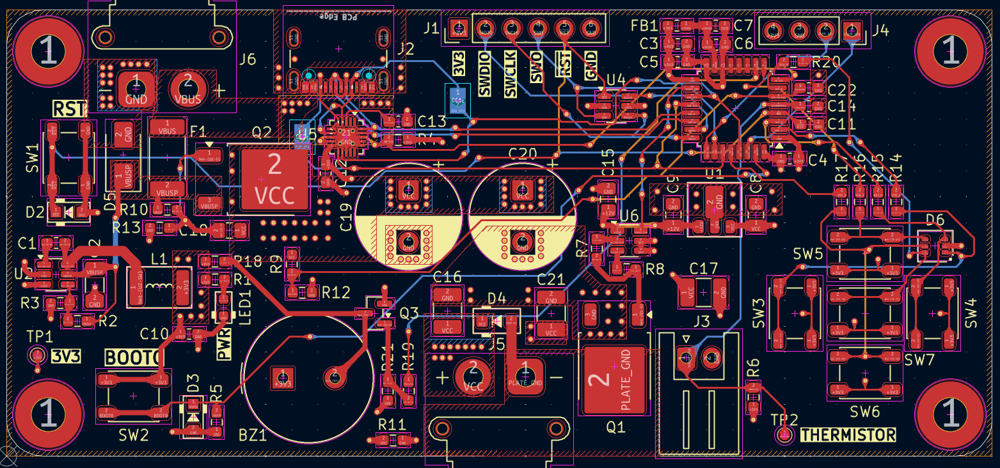
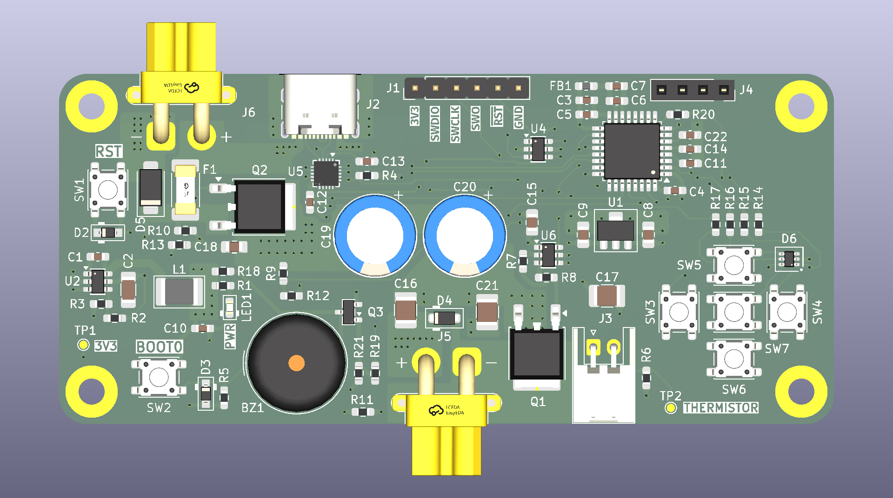
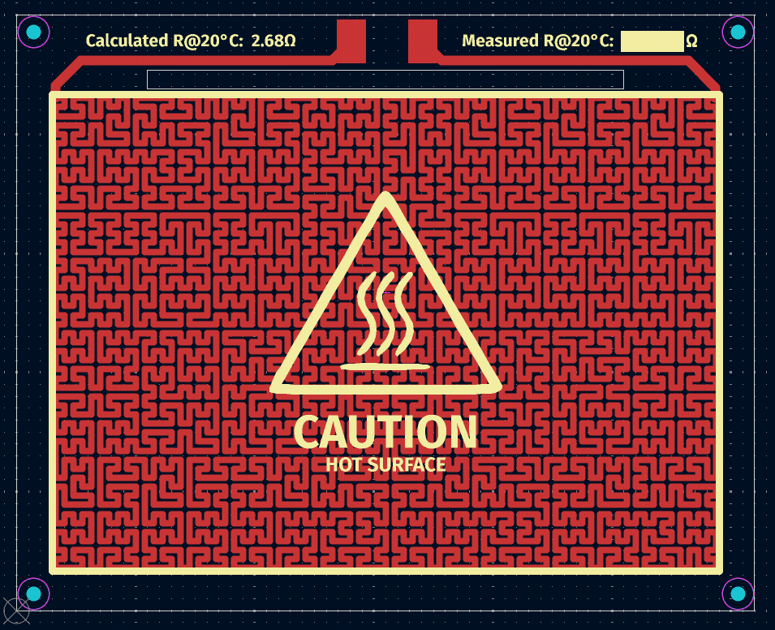
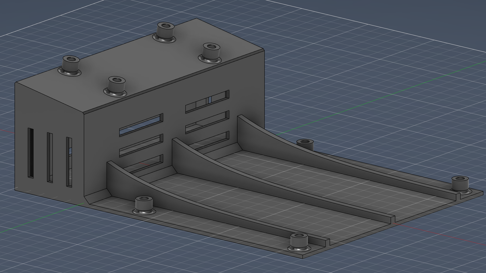
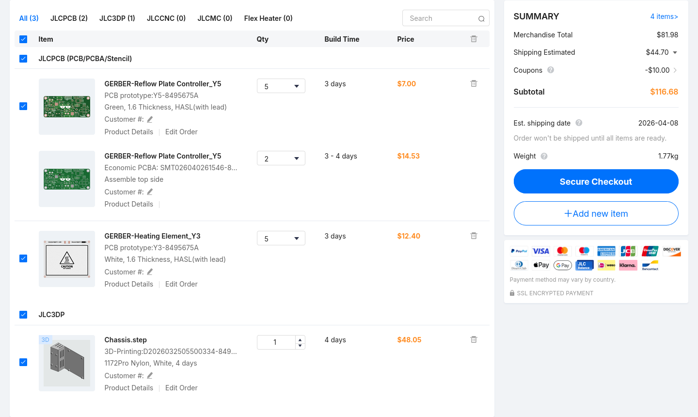
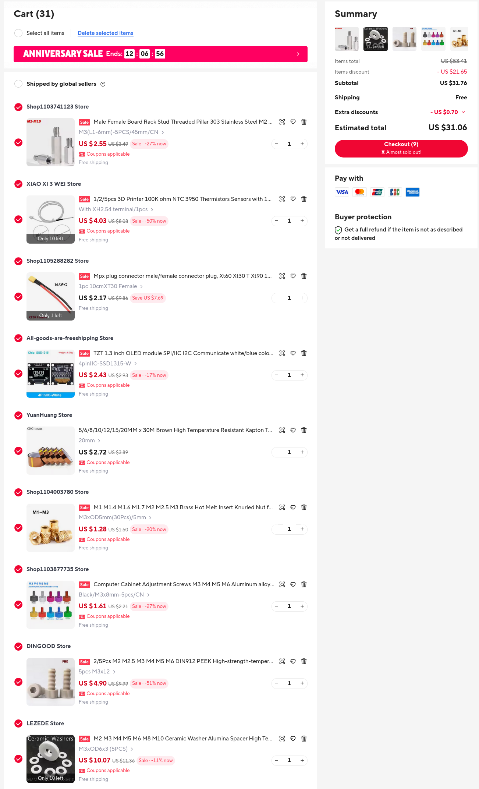

<h1 align="center">
	USB-C PD Reflow Plate
	<br />
	<br />
	
	<br />
</h1>

<h4 align="center">
A DIY PCB Reflow Plate. Accepts 300W from a DC power source, or 110W from USB PD.
</h4>

<div align="center">


</div>

<p align="center">
  <a href="#key-features">Key Features</a> •
  <a href="#hardware">Hardware</a> •
  <a href="#building-and-flashing-the-firmware">Building and Flashing</a> •
  <a href="#license">License</a>
</p>

## Key Features

- **Split design** that allows you to manufacture the heater PCB using aluminum
- Accepts **USB-C PD (up to 110W)** or **DC supply (up to 300W)**
- **STM32G431KBT6 microcontroller** with support for flashing over USB and SWD
- **1.3" OLED display** for selecting alloys and showing progress
- **40 KHz PWM power delivery** to the heating element + a **970μF capacitor bank** to keep the average current under power supply limits

## Motivation

I started this project because existing designs had some flaws I disliked such as:

- No USB-C PD support
- Using obsolete Atmega chips that are too expensive for what they offer
- Not being powerful enough or requiring AC voltages which I don't want to mess around with
- Putting the electronics and heating elements on the same FR-4 PCB, making the longevity of the board questionable

This project is intended to address all these issues.

## Hardware

The hardware is split into two separate PCBs - a controller board and the heating element. This allows you to manufacture the heating element using aluminium to increase its longevity.

### Controller Board

#### Schematic

<a href="media/schematic.pdf"></a>

#### PCB



The controller PCB uses a 4 layer SIGNAL-GND-PWR-SIGNAL stackup. It measures under 100x50 mm, so you can get it manufactured for cheap at JLCPCB. 2x 470μF aluminum polymer capacitors are used to keep the average current within limits and smooth out the power supply.



### Heating Element



The traces are generated using the [Heater Generator Plugin](https://github.com/steltze/KiCad-Heater-Generator-Plugin), which uses the Hilbert Space Filling Curve to generate traces in a given bounding box.

The calculated resistance at 20°C is approximately 2.68Ω. The actual resistance after manufacturing can vary, but slight differences should not be a problem as long as the firmware is updated with the new value.

## Chassis

The chassis is made in Fusion360 and is designed to be printed using SLS/MJF nylon at JLC3DP. It occupies a bounding box of 225x166x75 mm and a total volume of 136 cm³.



## Manufacturing

All files related to manufacturing can be found in the `production` folder.

### BOM

<details>
<summary>Click to Expand / Collapse</summary>
<br />

The list of PCB components can be found [here.](production/Reflow%20Plate%20Controller/BOM-Reflow%20Plate%20Controller.csv)

| Name | Comment | Price ($USD) | Link |
|------|---------|--------------|------|
| PCB Components | Detailed BOM in production/Reflow Plate Controller/BOM-Reflow Plate Controller.csv | $25.63 |  |
| "1.3"" SSD1315 OLED Display" |  | $2.43 | <https://www.aliexpress.com/item/1005008365029314.html> |
| Glass NTC Thermistor | Must be able to withstand at least 250C | $4.03 | <https://www.aliexpress.com/item/1005008996648273.html> |
| Kapton Tape | For attaching the thermistor to the heating element | $2.72 | <https://www.aliexpress.com/item/33036160119.html> |
| XT30 Female Connector | For connecting the controller to the heating element | $2.17 | <https://www.aliexpress.com/item/1005011848365155.html> |
| M3x12 PEEK Screws | PEEK material chosen for insulation | $4.90 | <https://www.aliexpress.com/item/1005009212510720.html> |
| M3 Ceramic Washers | For insulation | $10.07 | <https://www.aliexpress.com/item/1005006898159426.html> |
| M3x45 Stainless Steel Standoffs | For insulation and attaching the heating element to the chassis | $2.55 | <https://www.aliexpress.com/item/1005010143571846.html> |
| M3x8 Screws | For attaching the controller PCB to the chassis | $1.61 | <https://www.aliexpress.com/item/1005010666684312.html> |
| M3x5x5 Heat Set Inserts |  | $1.28 | <https://www.aliexpress.com/item/1005010449185019.html> |
| JLCPCB (Controller Board) |  | $7.00 |  |
| JLCPCBA (Controller Board) |  | $14.53 |  |
| JLCPCB (Heating Element) |  | $12.40 |  |
| JLC3DP (SLS 1172Pro Nylon) |  | $48.05 |  |
| JLC Shipping |  | $44.70 |  |
| LCSC Shipping |  | $14.80 |  |
| Total |  | $199 |  |

</details>

### JLC Cart

<details>
<summary>Click to Expand / Collapse</summary>
<br />



</details>

### Aliexpress Cart

<details>
<summary>Click to Expand / Collapse</summary>
<br />



</details>

## Assembly

Heat up your soldering iron to the appropriate temperature for your chassis material. Take a heat-set insert, place it on a hole, and slowly push it through using the iron until the tip of the insert is flat with the surrounding surface. Repeat for the remaining screw holes.

Now you can go ahead and attach the PCBs using standoffs and screws.

## Building and Flashing the Firmware

The firmware is written in Rust. To build it, install the [rust toolchain](https://rust-lang.org/tools/install/) then run the following commands to install all the required components.

```bash
rustup target add thumbv7em-none-eabihf
cargo install cargo-binstall
cargo binstall cargo-dfu probe-rs-tools
```

### Flash Over USB

Plug in the controller board to your computer while holding the BOOT0 button to put the microcontroller in DFU mode. Then run:

```bash
cargo dfu --release
```

### Flash Over SWD (ST-LINK)

Connect your ST-LINK to the controller board using the SWD headers, then run:

```bash
cargo flash --release --chip STM32G431KB
```

## License

- `firmware/` is licensed under [GNU GPL v3](firmware/LICENSE)
- Rest of the repository is licensed under [CERN-OHL-S](LICENSE)